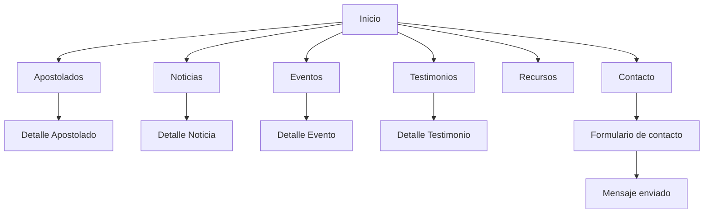

# Configuración de Entornos - HMSP

## 📋 Tabla de Contenidos
- [Entorno Local (Desarrollo)](#entorno-local-desarrollo)
- [Entorno Producción (VPS Hostinger)](#entorno-producción-vps-hostinger)
- [Diferencias Principales](#diferencias-principales)
- [Comandos Útiles](#comandos-útiles)
- [Documentación para el Usuario Web (Frontend)](#-documentación-para-el-usuario-web-frontend)
- [Documentación para el Usuario del Panel de Admin](#-documentación-para-el-usuario-del-panel-de-admin)

---

## 🏠 Entorno Local (Desarrollo)

### **Ubicación**
```
C:\Dev\Python\portfolio\hmsp\
```

### **Configuración**
- **Sistema Operativo:** Windows
- **Python:** 3.x (entorno virtual en `.venv`)
- **Django:** 5.2.7
- **Base de Datos:** SQLite (`db.sqlite3`)
- **Puerto:** 8081
- **URL:** `http://localhost:8081`

### **Archivos de Configuración**
- **Settings:** `hmsp/settings.py` (configuración base)
- **Debug:** `True`
- **Allowed Hosts:** `['localhost', '127.0.0.1']`

### **Estructura de Directorios**
```
C:\Dev\Python\portfolio\hmsp\
├── manage.py
├── db.sqlite3                      # Base de datos SQLite
├── requirements.txt
├── .venv\                          # Entorno virtual
├── hmsp\
│   ├── settings.py                 # Configuración desarrollo
│   ├── urls.py
│   ├── wsgi.py
│   └── apps\
│       ├── core\
│       └── backoffice\
├── templates\
├── static\                         # Archivos estáticos desarrollo
├── staticfiles\                    # Archivos estáticos recolectados
├── media\                          # Archivos subidos
└── docs\
    ├── despliegue-vps-hostinger.md
    └── configuracion-entornos.md
```

### **Comandos para Desarrollo**

**Activar entorno virtual:**
```powershell
.\.venv\Scripts\Activate.ps1
```

**Ejecutar servidor de desarrollo:**
```powershell
python manage.py runserver 8081
```

**Recolectar archivos estáticos:**
```powershell
python manage.py collectstatic --noinput
```

**Aplicar migraciones:**
```powershell
python manage.py migrate
```

**Crear superusuario:**
```powershell
python manage.py createsuperuser
```

---

## 🌐 Entorno Producción (VPS Hostinger)

### **Servidor**
- **Proveedor:** Hostinger VPS
- **IP:** 72.61.132.193
- **SO:** Ubuntu/Debian
- **Dominio:** hmsp.cl, www.hmsp.cl
- **Acceso SSH:** `ssh root@72.61.132.193`

### **Stack Tecnológico**
- **Python:** 3.12
- **Django:** 5.2.8
- **Servidor WSGI:** Gunicorn 23.0.0 (3 workers)
- **Reverse Proxy:** Nginx 1.24.0
- **Gestor de Procesos:** Supervisor
- **Base de Datos:** MySQL 8.0
- **SSL/CDN:** Cloudflare (modo Flexible)

### **Ubicación del Proyecto**
```
/home/hmsp/proyecto/
```

### **Estructura de Directorios en Producción**
```
/home/hmsp/proyecto/
├── manage.py
├── requirements.txt
├── start_gunicorn.sh               # Script inicio Gunicorn
├── gunicorn.sock                   # Socket Unix
├── venv/                           # Entorno virtual Python
├── hmsp/
│   ├── settings.py                 # Configuración base
│   ├── settings_prod.py            # Configuración producción
│   ├── urls.py
│   ├── wsgi.py
│   └── apps/
│       ├── core/
│       └── backoffice/
├── templates/
├── static/                         # Archivos estáticos fuente
├── staticfiles/                    # Archivos estáticos servidos por Nginx
├── media/                          # Archivos subidos por usuarios
│   ├── configuracion/
│   ├── eventos/
│   ├── noticias/
│   └── testimonios/
└── logs/
    ├── gunicorn.log
    └── gunicorn_error.log
```

### **Configuración de Producción**

#### **Django Settings (`settings_prod.py`)**
```python
from hmsp.settings import *
import os

DEBUG = True  # Cambia a False en producción
ALLOWED_HOSTS = ['hmsp.cl', 'www.hmsp.cl', '72.61.132.193']

DATABASES = {
    'default': {
        'ENGINE': 'django.db.backends.mysql',
        'NAME': 'hmsp_db',
        'USER': 'hmsp_user',
        'PASSWORD': '0308Luis$',
        'HOST': 'localhost',
        'PORT': '3306',
        'OPTIONS': {
            'init_command': "SET sql_mode='STRICT_TRANS_TABLES'",
            'charset': 'utf8mb4',
        }
    }
}

CSRF_TRUSTED_ORIGINS = [
    'https://hmsp.cl',
    'https://www.hmsp.cl',
]

SECRET_KEY = os.environ.get('SECRET_KEY', 'django-insecure-cambiar-en-produccion-2024')
SECURE_PROXY_SSL_HEADER = ('HTTP_X_FORWARDED_PROTO', 'https')
SECURE_SSL_REDIRECT = False
SESSION_COOKIE_SECURE = True
CSRF_COOKIE_SECURE = True
SECURE_BROWSER_XSS_FILTER = True
SECURE_CONTENT_TYPE_NOSNIFF = True
X_FRAME_OPTIONS = 'DENY'

STATIC_ROOT = '/home/hmsp/proyecto/staticfiles/'
MEDIA_ROOT = '/home/hmsp/proyecto/media/'
STATIC_URL = '/static/'
MEDIA_URL = '/media/'

EMAIL_BACKEND = 'django.core.mail.backends.smtp.EmailBackend'
EMAIL_HOST = 'smtp.hostinger.com'
EMAIL_PORT = 587
EMAIL_USE_TLS = True
EMAIL_HOST_USER = 'contacto@hmsp.cl'
EMAIL_HOST_PASSWORD = 'At6TJigY?jQ&Dqx'
DEFAULT_FROM_EMAIL = 'contacto@hmsp.cl'
```

#### **Gunicorn (`start_gunicorn.sh`)**
```bash
#!/bin/bash
NAME=hmsp
DIR=/home/hmsp/proyecto
USER=hmsp
GROUP=hmsp
WORKERS=3
BIND=unix:/home/hmsp/proyecto/gunicorn.sock
DJANGO_SETTINGS_MODULE=hmsp.settings_prod
DJANGO_WSGI_MODULE=hmsp.wsgi
LOG_LEVEL=error

cd $DIR
source venv/bin/activate

exec venv/bin/gunicorn ${DJANGO_WSGI_MODULE}:application \
  --name $NAME \
  --workers $WORKERS \
  --user=$USER \
  --group=$GROUP \
  --bind=$BIND \
  --log-level=$LOG_LEVEL \
  --log-file=-
```

#### **Supervisor (`/etc/supervisor/conf.d/hmsp.conf`)**
```ini
[program:hmsp]
command=/home/hmsp/proyecto/start_gunicorn.sh
user=root
directory=/home/hmsp/proyecto
autostart=true
autorestart=true
redirect_stderr=true
stdout_logfile=/home/hmsp/proyecto/logs/gunicorn.log
stderr_logfile=/home/hmsp/proyecto/logs/gunicorn_error.log
```

#### **Nginx (`/etc/nginx/sites-available/hmsp`)**
```nginx
server {
    listen 80;
    server_name hmsp.cl www.hmsp.cl 72.61.132.193;
    client_max_body_size 20M;

    location = /favicon.ico { 
        access_log off; 
        log_not_found off; 
    }

    location ~ /.well-known {
        allow all;
        root /var/www/html;
    }

    location /static/ {
        alias /home/hmsp/proyecto/staticfiles/;
    }

    location /media/ {
        alias /home/hmsp/proyecto/media/;
    }

    location / {
        proxy_pass http://unix:/home/hmsp/proyecto/gunicorn.sock;
        proxy_set_header Host $host;
        proxy_set_header X-Real-IP $remote_addr;
        proxy_set_header X-Forwarded-For $proxy_add_x_forwarded_for;
        proxy_set_header X-Forwarded-Proto $scheme;
    }
}
```

### **Base de Datos MySQL**
- **Nombre:** `hmsp_db`
- **Usuario:** `hmsp_user`
- **Password:** `0308Luis$`
- **Host:** `localhost`
- **Puerto:** `3306`

### **Cloudflare**
- **Cuenta:** automatizacionesbotcore@gmail.com
- **Plan:** Free
- **Dashboard:** https://dash.cloudflare.com/
- **Nameservers:**
  - elias.ns.cloudflare.com
  - jule.ns.cloudflare.com
- **Estado:** Active (DNS propagado)

#### **Configuración SSL/TLS**
- **Modo:** Flexible
  - Usuario ↔ Cloudflare: **HTTPS** (encriptado)
  - Cloudflare ↔ Servidor: **HTTP** (sin encriptación)
- **Certificado:** Cloudflare Universal SSL
  - Tipo: Shared
  - Hosts: `*.hmsp.cl`, `hmsp.cl`
  - Vencimiento: 17 de febrero de 2026
  - Estado: Managed (renovación automática)
- **Always Use HTTPS:** Desactivado (para evitar loop de redirección)
- **Automatic HTTPS Rewrites:** Activado
- **Minimum TLS Version:** TLS 1.0
- **TLS 1.3:** Activado
- **HSTS:** Desactivado

#### **DNS Records**
| Tipo | Nombre | Contenido | Proxy | TTL |
|------|--------|-----------|-------|-----|
| A | @ | 72.61.132.193 | Proxied (naranja) | Auto |
| A | www | 72.61.132.193 | Proxied (naranja) | Auto |

#### **Caching**
- **Configuración:** Default
- **Browser Cache TTL:** Respect Existing Headers
- **Purge Cache:** Manual cuando sea necesario

#### **Seguridad**
- **Security Level:** Medium
- **Challenge Passage:** 30 minutes
- **Browser Integrity Check:** On
- **Privacy Pass:** On
- **Bot Fight Mode:** Disponible (Free plan)

#### **Optimización**
- **Auto Minify:** Disponible para CSS, JS, HTML
- **Brotli:** Activado
- **Early Hints:** Disponible
- **HTTP/2:** Activado
- **HTTP/3 (QUIC):** Activado
- **0-RTT Connection Resumption:** Activado

#### **Comandos Útiles Cloudflare**
```bash
# Limpiar toda la caché
Dashboard → Caching → Purge Everything

# Verificar propagación DNS
https://dnschecker.org/#A/hmsp.cl

# Ver configuración SSL/TLS
Dashboard → SSL/TLS → Overview

# Gestionar certificados
Dashboard → SSL/TLS → Edge Certificates
```

### **Usuarios Admin**
- **Username:** `hmsp`
- **Email:** `lmgm.0303@gmail.com`
- **Panel:** https://hmsp.cl/admin/

---

## ⚖️ Diferencias Principales

| Característica | Local (Desarrollo) | Producción (VPS) |
|---|---|---|
| **URL** | http://localhost:8081 | https://hmsp.cl |
| **Sistema Operativo** | Windows | Ubuntu/Debian |
| **Python** | 3.x | 3.12 |
| **Base de Datos** | SQLite | MySQL 8.0 |
| **Servidor Web** | Django runserver | Nginx + Gunicorn |
| **Settings** | `settings.py` | `settings_prod.py` |
| **DEBUG** | True | False |
| **HTTPS/SSL** | No | Sí (Cloudflare) |
| **Archivos Estáticos** | Django sirve | Nginx sirve |
| **Auto-restart** | Manual | Supervisor |
| **Logs** | Consola | `/home/hmsp/proyecto/logs/` |
| **Email** | Console backend | SMTP (Hostinger) |

---

## 🛠️ Comandos Útiles

### **En Producción (SSH)**

**Conectarse al servidor:**
```bash
ssh root@72.61.132.193
```

**Activar entorno virtual:**
```bash
cd /home/hmsp/proyecto
source venv/bin/activate
```

**Gestión de Servicios:**
```bash
# Supervisor (Gunicorn)
supervisorctl status                # Ver estado
supervisorctl restart hmsp          # Reiniciar
supervisorctl stop hmsp             # Detener
supervisorctl start hmsp            # Iniciar

# Nginx
systemctl status nginx              # Ver estado
systemctl restart nginx             # Reiniciar
systemctl reload nginx              # Recargar configuración
systemctl stop nginx                # Detener
systemctl start nginx               # Iniciar

# Docker (Easypanel, etc)
systemctl stop docker               # Detener Docker
systemctl start docker              # Iniciar Docker
```

**Django Management:**
```bash
# Aplicar migraciones
python manage.py migrate --settings=hmsp.settings_prod

# Recolectar estáticos
python manage.py collectstatic --noinput --settings=hmsp.settings_prod

# Crear superusuario
python manage.py createsuperuser --settings=hmsp.settings_prod

# Cambiar contraseña
python manage.py changepassword hmsp --settings=hmsp.settings_prod

# Ver usuarios admin
python manage.py shell --settings=hmsp.settings_prod -c "from django.contrib.auth import get_user_model; User = get_user_model(); [print(f'Usuario: {u.username}, Email: {u.email}') for u in User.objects.filter(is_superuser=True)]"
```

**Logs:**
```bash
# Logs de Gunicorn
tail -f /home/hmsp/proyecto/logs/gunicorn.log
tail -f /home/hmsp/proyecto/logs/gunicorn_error.log

# Logs de Nginx
tail -f /var/log/nginx/access.log
tail -f /var/log/nginx/error.log

# Logs de Supervisor
tail -f /var/log/supervisor/supervisord.log
```

**Verificar conexiones:**
```bash
# Ver qué está usando el puerto 80
netstat -tulpn | grep :80

# Probar respuesta local
curl -I http://localhost
curl -I -H "Host: hmsp.cl" http://localhost
```

---

## 🔄 Flujo de Despliegue

### **Actualizar código en producción:**

1. **Subir archivos por FTP/FileZilla:**
   - Host: 72.61.132.193
   - Usuario: hmsp (o root)
   - Carpeta: `/home/hmsp/proyecto/`

2. **Recolectar archivos estáticos:**
   ```bash
   cd /home/hmsp/proyecto
   source venv/bin/activate
   python manage.py collectstatic --noinput --settings=hmsp.settings_prod
   ```

3. **Aplicar migraciones (si hay cambios en DB):**
   ```bash
   python manage.py migrate --settings=hmsp.settings_prod
   ```

4. **Reiniciar Gunicorn:**
   ```bash
   supervisorctl restart hmsp
   ```

5. **Limpiar caché de Cloudflare:**
   - Dashboard Cloudflare → Caching → Purge Everything

---

## 📝 Notas Importantes

### **Seguridad:**
- En producción, `DEBUG = False` para no exponer información sensible
- Cloudflare maneja SSL/TLS, el servidor trabaja en HTTP
- Firewall UFW disponible pero no configurado aún

### **Servicios Adicionales en el VPS:**
- Docker con Traefik (se detiene cuando se usa Nginx)
- Easypanel
- n8n
- Chatwoot
- Evolution API

### **Backup:**
- Base de datos local: `db.sqlite3` (desarrollo)
- Base de datos producción: MySQL debe respaldarse periódicamente
- Archivos media: `/home/hmsp/proyecto/media/`

### **Email:**
- Servidor SMTP: smtp.hostinger.com
- Puerto: 587 (TLS)
- Usuario: contacto@hmsp.cl
- Configurado en `settings_prod.py`

---

## 👤 Documentación para el Usuario Web (Frontend)

### Acceso al sitio
- **URL pública:** [https://hmsp.cl](https://hmsp.cl)
- **Navegación:**
  - Menú principal con acceso a: Inicio, Apostolados, Noticias, Eventos, Testimonios, Contacto, Recursos.
  - Cada sección tiene su propia vista de detalle.
- **Subida de imágenes:** Solo disponible para administradores en el panel de admin.
- **Formulario de contacto:** Disponible para cualquier usuario, requiere completar nombre, email y mensaje.
- **Idiomas:** Español (traducción automática en algunos textos).
- **Seguridad:**
  - El sitio usa HTTPS (Cloudflare).
  - Los datos enviados por formularios están protegidos por CSRF.

### Permisos del usuario web
- Puede navegar y ver todo el contenido público.
- Puede enviar mensajes de contacto.
- No puede modificar, eliminar ni subir contenido.

---

## 🛡️ Documentación para el Usuario del Panel de Admin

### Acceso al panel de administración
- **URL:** [https://hmsp.cl/admin/](https://hmsp.cl/admin/)
- **Credenciales:** Proporcionadas por el administrador del sistema.
- **Recuperación de contraseña:** Usar la opción "¿Olvidó su contraseña?" en el login.

### Permisos y roles
- **Superusuario:**
  - Acceso total a todas las secciones y modelos.
  - Puede crear, editar, eliminar y aprobar contenido (apostolados, eventos, noticias, testimonios, oraciones, usuarios).
  - Puede gestionar usuarios y permisos.
- **Staff:**
  - Acceso limitado según permisos asignados.
  - Puede editar solo los modelos permitidos por el superusuario.

### Funcionalidades del panel
- **Apostolados:** Crear, editar, eliminar y subir imágenes.
- **Eventos:** Crear, editar, eliminar y subir imágenes/videos.
- **Noticias:** Crear, editar, eliminar y subir imágenes.
- **Testimonios:** Crear, editar, eliminar y subir imágenes.
- **Oraciones:** Crear, editar, eliminar.
- **Configuración del sitio:** Editar textos, imágenes y enlaces generales.
- **Mensajes de contacto:** Solo lectura, no se pueden crear desde el admin.
- **Recursos:** Editar títulos, textos e imágenes.

### Seguridad y buenas prácticas
- No compartir credenciales de admin.
- Usar contraseñas seguras y cambiarlas periódicamente.
- Cerrar sesión después de usar el panel.
- No subir archivos de gran tamaño ni formatos no permitidos.
- Revisar los logs y notificaciones de errores en el panel.

---

## 🗂️ Diagrama de flujo para el usuario web (frontend)



---

## 🗂️ Diagrama de flujo para el usuario del panel de admin

```mermaid
flowchart TD
    AA[Login Admin] --> AB[Dashboard]
    AB --> AC[Apostolados]
    AB --> AD[Eventos]
    AB --> AE[Noticias]
    AB --> AF[Testimonios]
    AB --> AG[Oraciones]
    AB --> AH[Configuración Sitio]
    AB --> AI[Mensajes de Contacto]
    AC --> AC1[Crear/Editar/Eliminar Apostolado]
    AD --> AD1[Crear/Editar/Eliminar Evento]
    AE --> AE1[Crear/Editar/Eliminar Noticia]
    AF --> AF1[Crear/Editar/Eliminar Testimonio]
    AG --> AG1[Crear/Editar/Eliminar Oración]
    AH --> AH1[Editar textos, imágenes, enlaces]
    AI --> AI1[Leer mensajes]
    AB --> AJ[Gestión de usuarios y permisos]
```



---

**Última actualización:** 19 de noviembre de 2025
