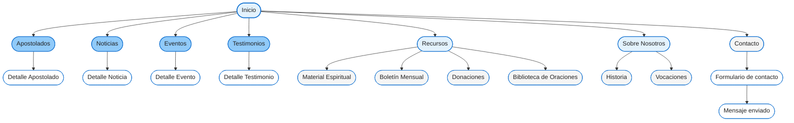
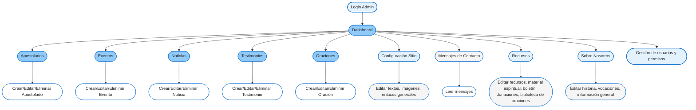

# Diagramas de Flujo de Usuarios HMSP

## 🗂️ Diagrama de flujo para el usuario web (frontend)

```mermaid
flowchart TD
    %% Colores estándar HMSP: azul claro (#e3f2fd), azul medio (#90caf9), gris claro (#f5f5f5)
    style A fill:#e3f2fd,stroke:#1976d2,stroke-width:2px,color:#222
    style B fill:#90caf9,stroke:#1976d2,stroke-width:1.5px,color:#222
    style C fill:#90caf9,stroke:#1976d2,stroke-width:1.5px,color:#222
    style D fill:#90caf9,stroke:#1976d2,stroke-width:1.5px,color:#222
    style E fill:#90caf9,stroke:#1976d2,stroke-width:1.5px,color:#222
    style F fill:#e3f2fd,stroke:#1976d2,stroke-width:1.5px,color:#222
    style G fill:#f5f5f5,stroke:#1976d2,stroke-width:1.5px,color:#222
    style H fill:#e3f2fd,stroke:#1976d2,stroke-width:1.5px,color:#222
    style B1 fill:#fff,stroke:#1976d2,stroke-width:1px,color:#222
    style C1 fill:#fff,stroke:#1976d2,stroke-width:1px,color:#222
    style D1 fill:#fff,stroke:#1976d2,stroke-width:1px,color:#222
    style E1 fill:#fff,stroke:#1976d2,stroke-width:1px,color:#222
    style F1 fill:#f5f5f5,stroke:#1976d2,stroke-width:1px,color:#222
    style F2 fill:#f5f5f5,stroke:#1976d2,stroke-width:1px,color:#222
    style F3 fill:#f5f5f5,stroke:#1976d2,stroke-width:1px,color:#222
    style F4 fill:#f5f5f5,stroke:#1976d2,stroke-width:1px,color:#222
    style H1 fill:#f5f5f5,stroke:#1976d2,stroke-width:1px,color:#222
    style H2 fill:#f5f5f5,stroke:#1976d2,stroke-width:1px,color:#222
    style G1 fill:#fff,stroke:#1976d2,stroke-width:1px,color:#222
    style I fill:#fff,stroke:#1976d2,stroke-width:1px,color:#222
    A([Inicio]) --> B([Apostolados])
    A --> C([Noticias])
    A --> D([Eventos])
    A --> E([Testimonios])
    A --> F([Recursos])
    A --> G([Contacto])
    A --> H([Sobre Nosotros])
    F --> F1([Material Espiritual])
    F --> F2([Boletín Mensual])
    F --> F3([Donaciones])
    F --> F4([Biblioteca de Oraciones])
    H --> H1([Historia])
    H --> H2([Vocaciones])
    B --> B1([Detalle Apostolado])
    C --> C1([Detalle Noticia])
    D --> D1([Detalle Evento])
    E --> E1([Detalle Testimonio])
    G --> G1([Formulario de contacto])
    G1 --> I([Mensaje enviado])
```

---

## 🗂️ Diagrama de flujo para el usuario del panel de admin

```mermaid
flowchart TD
    %% Colores estándar HMSP: azul claro (#e3f2fd), azul medio (#90caf9), gris claro (#f5f5f5)
    style AA fill:#e3f2fd,stroke:#1976d2,stroke-width:2px,color:#222
    style AB fill:#90caf9,stroke:#1976d2,stroke-width:1.5px,color:#222
    style AC fill:#90caf9,stroke:#1976d2,stroke-width:1.5px,color:#222
    style AD fill:#90caf9,stroke:#1976d2,stroke-width:1.5px,color:#222
    style AE fill:#90caf9,stroke:#1976d2,stroke-width:1.5px,color:#222
    style AF fill:#90caf9,stroke:#1976d2,stroke-width:1.5px,color:#222
    style AG fill:#90caf9,stroke:#1976d2,stroke-width:1.5px,color:#222
    style AH fill:#e3f2fd,stroke:#1976d2,stroke-width:1.5px,color:#222
    style AI fill:#f5f5f5,stroke:#1976d2,stroke-width:1.5px,color:#222
    style AJ fill:#e3f2fd,stroke:#1976d2,stroke-width:1.5px,color:#222
    style AK fill:#e3f2fd,stroke:#1976d2,stroke-width:1.5px,color:#222
    style AC1 fill:#fff,stroke:#1976d2,stroke-width:1px,color:#222
    style AD1 fill:#fff,stroke:#1976d2,stroke-width:1px,color:#222
    style AE1 fill:#fff,stroke:#1976d2,stroke-width:1px,color:#222
    style AF1 fill:#fff,stroke:#1976d2,stroke-width:1px,color:#222
    style AG1 fill:#fff,stroke:#1976d2,stroke-width:1px,color:#222
    style AH1 fill:#f5f5f5,stroke:#1976d2,stroke-width:1px,color:#222
    style AI1 fill:#fff,stroke:#1976d2,stroke-width:1px,color:#222
    style AJ1 fill:#f5f5f5,stroke:#1976d2,stroke-width:1px,color:#222
    style AK1 fill:#f5f5f5,stroke:#1976d2,stroke-width:1px,color:#222
    style AL fill:#e3f2fd,stroke:#1976d2,stroke-width:2px,color:#222
    AA([Login Admin]) --> AB([Dashboard])
    AB --> AC([Apostolados])
    AB --> AD([Eventos])
    AB --> AE([Noticias])
    AB --> AF([Testimonios])
    AB --> AG([Oraciones])
    AB --> AH([Configuración Sitio])
    AB --> AI([Mensajes de Contacto])
    AB --> AJ([Recursos])
    AB --> AK([Sobre Nosotros])
    AC --> AC1([Crear/Editar/Eliminar Apostolado])
    AD --> AD1([Crear/Editar/Eliminar Evento])
    AE --> AE1([Crear/Editar/Eliminar Noticia])
    AF --> AF1([Crear/Editar/Eliminar Testimonio])
    AG --> AG1([Crear/Editar/Eliminar Oración])
    AH --> AH1([Editar textos, imágenes, enlaces generales])
    AI --> AI1([Leer mensajes])
    AJ --> AJ1([Editar recursos, material espiritual, boletín, donaciones, biblioteca de oraciones])
    AK --> AK1([Editar historia, vocaciones, información general])
    AB --> AL([Gestión de usuarios y permisos])
```

---
